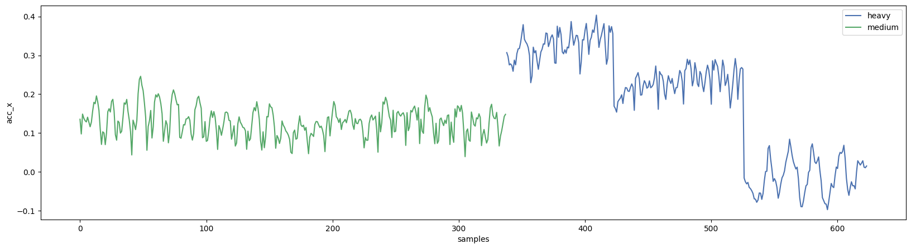

# Data Visualization with Matplotlib

## Objective

The main object of this process is to visualize the dataset we saved after [data processing](../src/data/data_processing.py). It is the least important part of this project, but you know how to visualize the data for the later steps of this project.

> The dataset we have from the data processing.

<div>
<table border="1" class="dataframe">
  <thead>
    <tr style="text-align: right;">
      <th></th>
      <th>acc_x</th>
      <th>acc_y</th>
      <th>acc_z</th>
      <th>gyr_x</th>
      <th>gyr_y</th>
      <th>gyr_z</th>
      <th>participant</th>
      <th>label</th>
      <th>category</th>
      <th>set</th>
    </tr>
    <tr>
      <th>epoch (ms)</th>
      <th></th>
      <th></th>
      <th></th>
      <th></th>
      <th></th>
      <th></th>
      <th></th>
      <th></th>
      <th></th>
      <th></th>
    </tr>
  </thead>
  <tbody>
    <tr>
      <th>2019-01-11 15:08:05.200</th>
      <td>0.013500</td>
      <td>0.977000</td>
      <td>-0.071000</td>
      <td>-1.8904</td>
      <td>2.4392</td>
      <td>0.9388</td>
      <td>B</td>
      <td>bench</td>
      <td>heavy</td>
      <td>11</td>
    </tr>
    <tr>
      <th>2019-01-11 15:08:05.400</th>
      <td>-0.001500</td>
      <td>0.970500</td>
      <td>-0.079500</td>
      <td>-1.6826</td>
      <td>-0.8904</td>
      <td>2.1708</td>
      <td>B</td>
      <td>bench</td>
      <td>heavy</td>
      <td>11</td>
    </tr>
    <tr>
      <th>2019-01-11 15:08:05.600</th>
      <td>0.001333</td>
      <td>0.971667</td>
      <td>-0.064333</td>
      <td>2.5608</td>
      <td>-0.2560</td>
      <td>-1.4146</td>
      <td>B</td>
      <td>bench</td>
      <td>heavy</td>
      <td>11</td>
    </tr>
    <tr>
      <th>2019-01-11 15:08:05.800</th>
      <td>-0.024000</td>
      <td>0.957000</td>
      <td>-0.073500</td>
      <td>8.0610</td>
      <td>-4.5244</td>
      <td>-2.0730</td>
      <td>B</td>
      <td>bench</td>
      <td>heavy</td>
      <td>11</td>
    </tr>
    <tr>
      <th>2019-01-11 15:08:06.000</th>
      <td>-0.028000</td>
      <td>0.957667</td>
      <td>-0.115000</td>
      <td>2.4390</td>
      <td>-1.5486</td>
      <td>-3.6098</td>
      <td>B</td>
      <td>bench</td>
      <td>heavy</td>
      <td>11</td>
    </tr>
  </tbody>
</table>
</div>

## Process

#### Step 01: Adjusting the plot settings

This will make the plots more visually appealing and clean to see.

```py
# Set the style and figure parameters for matplotlib
mpl.style.use("seaborn-v0_8-deep")
mpl.rcParams["figure.figsize"] = (20, 5)  # Set the figure size to 20x5 inches
mpl.rcParams["figure.dpi"] = 100  # Set the figure resolution to 100 DPI
```

#### Step 02: Plotting the first 100 data points to see the difference more clearly

We will plot the data for all the labels to see the clear difference between all the different types of exercise the participant have participated to. In this case we are comparing the `acc_x` feature of the data.

```py
# Loop through each unique label in the 'label' column of the DataFrame
for label in df["label"].unique():
    # Filter the DataFrame to include only rows with the current label
    subset = df[df["label"] == label]
    # Create a new figure and axis for each label
    fig, ax = plt.subplots()
    # Plot the first 100 rows of the 'acc_x' column of the filtered subset with the index reset
    plt.plot(subset[:100]["acc_x"].reset_index(drop="True"), label=label)
    plt.legend()
    plt.show()
```


#### Step 03: Compare medium vs heavy sets

Filter the DataFrame to include only rows where the `label` column is equal to `squat` and the `participant` column is equal to `A`, then reset the index.

```py
category_df = df.query("label == 'squat'").query("participant == 'A'").reset_index()
fig, ax = plt.subplots()
category_df.groupby(["category"])["acc_x"].plot()
ax.set_xlabel("samples")
ax.set_ylabel("acc_x")
plt.legend()
plt.show()
```



#### Step 04: Compare participants

Filter the DataFrame to include only rows where the `label` column is equal to `squat`, then sort the DataFrame by the `participant` column and reset the index.

```py
participant_df = df.query("label == 'squat'").sort_values("participant").reset_index()
fig, ax = plt.subplots()
participant_df.groupby(["participant"])["acc_x"].plot()
ax.set_xlabel("samples")
ax.set_ylabel("acc_x")
plt.legend()
plt.show()
```


#### Step 05: Plot multiple axes

Define the label and participant to filter the DataFrame

```py
label = "squat"
participant = "A"
```

Filter the DataFrame to include only rows where the `label` column is equal to the specified label and the `participant` column is equal to the specified participant, then reset the index.

```py
all_axis_df = (
    df.query(f"label == '{label}'")
    .query(f"participant == '{participant}'")
    .reset_index()
)
```

**Accelerometer data representation:** Plot the 'acc_x', 'acc_y', and 'acc_z' columns of the filtered DataFrame.

```py
# Create a figure and an axis for the plot
fig, ax = plt.subplots()
all_axis_df[["acc_x", "acc_y", "acc_z"]].plot(ax=ax)
ax.set_xlabel("samples")
ax.set_ylabel("acc - x y z")
plt.legend()
plt.show()
```


**Gyroscope data representation:** Plot the 'gyr_x', 'gyr_y', and 'gyr_z' columns of the filtered DataFrame.

```py
# Create a figure and an axis for the plot
fig, ax = plt.subplots()
all_axis_df[["gyr_x", "gyr_y", "gyr_z"]].plot(ax=ax)
ax.set_xlabel("samples")
ax.set_ylabel("gyr - x y z")
plt.legend()
plt.show()
```


#### Step 06: Create a loop to plot all combinations per sensor

```py

# Get the unique labels and participants from the DataFrame
labels = df["label"].unique()
participants = df["participant"].unique()

# Loop through each combination of label and participant
for label in labels:
    for participant in participants:
        # Filter the DataFrame to include only rows with the current label and participant, then reset the index
        all_axis_df = (
            df.query(f"label == '{label}'")
            .query(f"participant == '{participant}'")
            .reset_index()
        )

        # Check if the filtered DataFrame is not empty
        if len(all_axis_df) > 0:
            # Accelerometer data representation
            fig, ax = plt.subplots()
            all_axis_df[["acc_x", "acc_y", "acc_z"]].plot(ax=ax)
            ax.set_xlabel("samples")
            ax.set_ylabel("acc - x y z")
            plt.title(f"{label} ({participant})".title())
            plt.legend()
            plt.show()

# Loop through each combination of label and participant
for label in labels:
    for participant in participants:
        # Filter the DataFrame to include only rows with the current label and participant, then reset the index
        all_axis_df = (
            df.query(f"label == '{label}'")
            .query(f"participant == '{participant}'")
            .reset_index()
        )

        # Check if the filtered DataFrame is not empty
        if len(all_axis_df) > 0:
            # Gyroscope data representation
            fig, ax = plt.subplots()
            all_axis_df[["gyr_x", "gyr_y", "gyr_z"]].plot(ax=ax)
            ax.set_xlabel("samples")
            ax.set_ylabel("gyr - x y z")
            plt.title(f"{label} ({participant})".title())
            plt.legend()
            plt.show()
```

#### Step 07: Combine plots in one figure

Define the label and participant to filter the DataFrame

```py
label = "squat"
participant = "A"
```

Filter the DataFrame to include only rows where the `label` column is equal to the specified label and the `participant` column is equal to the specified participant, then reset the index

```py
combined_plot_df = (
    df.query(f"label == '{label}'")
    .query(f"participant == '{participant}'")
    .reset_index(drop="True")
)
```

```py
# Create a figure with two subplots (one row, two columns) that share the x-axis
fig, ax = plt.subplots(nrows=2, sharex=True, figsize=(20, 10))
# Plot the 'acc_x', 'acc_y', and 'acc_z' columns of the filtered DataFrame on the first subplot
combined_plot_df[["acc_x", "acc_y", "acc_z"]].plot(ax=ax[0])
# Plot the 'gyr_x', 'gyr_y', and 'gyr_z' columns of the filtered DataFrame on the second subplot
combined_plot_df[["gyr_x", "gyr_y", "gyr_z"]].plot(ax=ax[1])
# Add a legend to the first subplot
ax[0].legend(
    loc="upper center", bbox_to_anchor=(0.5, 1.15), ncol=3, fancybox=True, shadow=True
)
# Add a legend to the second subplot
ax[1].legend(
    loc="upper center", bbox_to_anchor=(0.5, 1.15), ncol=3, fancybox=True, shadow=True
)
# Set the label for the x-axis of the second subplot
ax[1].set_xlabel("samples")
# Loop over all combinations and export for both sensors
labels = df["label"].unique()
participants = df["participant"].unique()
```


#### Step 08: Loop over all combinations and export for both sensors

```py
labels = df["label"].unique()
participants = df["participant"].unique()
```

```py
# Loop through each combination of label and participant
for label in labels:
    for participant in participants:
        # Filter the DataFrame to include only rows with the current label and participant, then reset the index
        combined_plot_df = (
            df.query(f"label == '{label}'")
            .query(f"participant == '{participant}'")
            .reset_index(drop="True")
        )

        # Check if the filtered DataFrame is not empty
        if len(combined_plot_df) > 0:
            # Create a figure with two subplots (one row, two columns) that share the x-axis
            fig, ax = plt.subplots(nrows=2, sharex=True, figsize=(20, 10))

            # Plot the 'acc_x', 'acc_y', and 'acc_z' columns of the filtered DataFrame on the first subplot
            combined_plot_df[["acc_x", "acc_y", "acc_z"]].plot(ax=ax[0])

            # Plot the 'gyr_x', 'gyr_y', and 'gyr_z' columns of the filtered DataFrame on the second subplot
            combined_plot_df[["gyr_x", "gyr_y", "gyr_z"]].plot(ax=ax[1])

            # Add a legend to the first subplot
            ax[0].legend(
                loc="upper center",
                bbox_to_anchor=(0.5, 1.15),
                ncol=3,
                fancybox=True,
                shadow=True,
            )

            # Add a legend to the second subplot
            ax[1].legend(
                loc="upper center",
                bbox_to_anchor=(0.5, 1.15),
                ncol=3,
                fancybox=True,
                shadow=True,
            )

            # Set the label for the x-axis of the second subplot
            ax[1].set_xlabel("samples")

            # Save the figure to a file
            plt.savefig(f"../../report/figures/{label.title()}_({participant}).png")
            # Uncomment the following line to display the plot
            plt.show()
```

> The output for this loop it saved in [report](<../report/figures/Bench_(A).png>) folder, which you can check out.

## Conclusion

This marks the end of the data visualization process, though it was not very important by knowing how to visualize the data will help us in next steps of this project.
